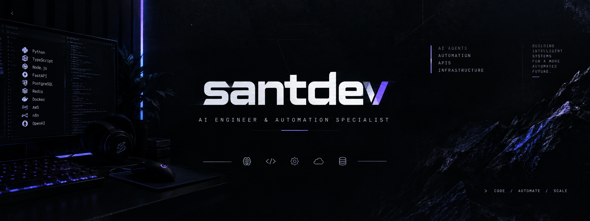

<div align="center">



<br>

### AI Engineer · Automation · Intelligent Systems

Building intelligent systems that connect AI, automation, APIs and infrastructure.

<br>

[](https://github.com/santdevfull)
[](https://openai.com)
[](https://n8n.io)
[](https://www.python.org)

</div>

---

## `01` — About

I'm an **AI Engineer & Automation Specialist** focused on building
intelligent systems that solve real-world problems.

My work sits at the intersection of:

- Artificial Intelligence
- LLM-powered systems
- AI Agents
- Workflow Automation
- APIs & Webhooks
- Backend systems
- Databases
- Cloud infrastructure

I enjoy taking an idea from a simple concept to a system that can
**understand context, execute workflows, integrate with external services
and operate reliably in production.**

---

## `02` — What I Build

<table>
<tr>
<td width="50%">

### AI Agents

Designing AI-powered systems capable of:

- Understanding context
- Following structured processes
- Calling external APIs
- Maintaining conversation state
- Executing automated actions

</td>

<td width="50%">

### Automation

Building workflows that connect:

- APIs
- Webhooks
- Databases
- AI models
- External services
- Business processes

</td>
</tr>

<tr>
<td width="50%">

### Conversational Systems

Developing intelligent support systems using:

- LLMs
- WhatsApp
- Chatwoot
- Context management
- State machines
- Human handoff

</td>

<td width="50%">

### Infrastructure

Working with:

- Docker
- Linux
- AWS
- PostgreSQL
- Redis
- Git / GitHub
- Production deployments

</td>
</tr>
</table>

---

## `03` — Featured Project

# 🤖 NivIA

### AI-powered support & automation system

**NivIA** is an AI-driven customer support system designed to automate
complex conversational workflows while maintaining context, state and
business rules.

The system combines **LLMs, workflow automation, APIs and persistent
state management** instead of treating the interaction as a simple
question-and-answer chatbot.

### Architecture

```text
                         ┌──────────────┐
                         │   WhatsApp   │
                         └──────┬───────┘
                                │
                                ▼
                         ┌──────────────┐
                         │   Chatwoot   │
                         └──────┬───────┘
                                │
                                ▼
                         ┌──────────────┐
                         │     n8n      │
                         │ Orchestrator │
                         └──────┬───────┘
                                │
                 ┌──────────────┼──────────────┐
                 │              │              │
                 ▼              ▼              ▼
          ┌────────────┐ ┌────────────┐ ┌────────────┐
          │ AI / LLM   │ │    APIs    │ │ PostgreSQL │
          │   Agent    │ │            │ │   State    │
          └────────────┘ └────────────┘ └────────────┘
                 │              │              │
                 └──────────────┼──────────────┘
                                ▼
                         ┌──────────────┐
                         │   Response   │
                         │ / Automation │
                         └──────────────┘
